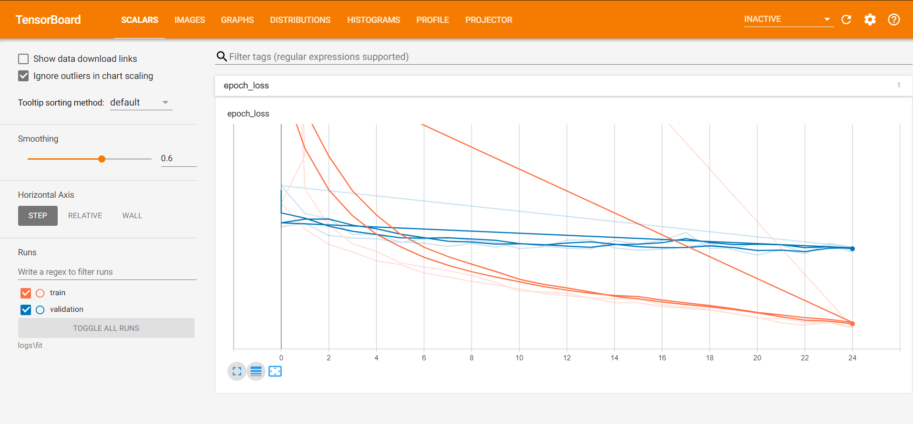
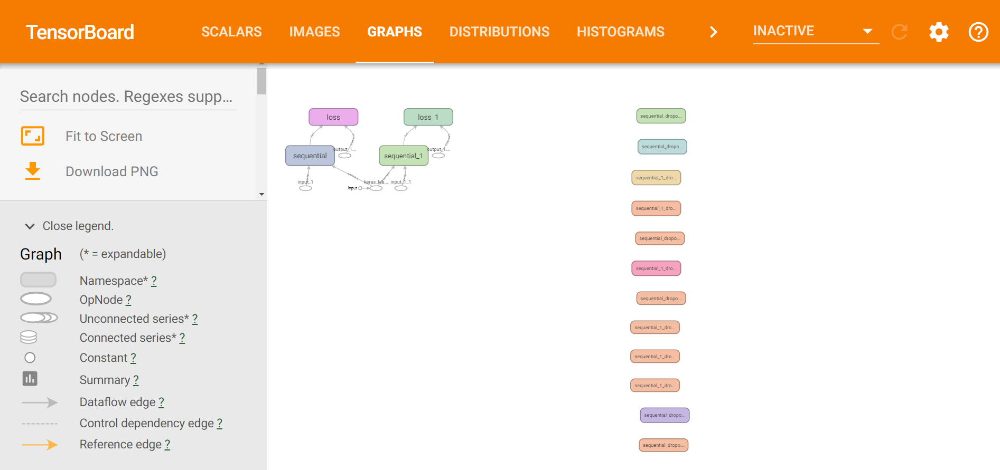
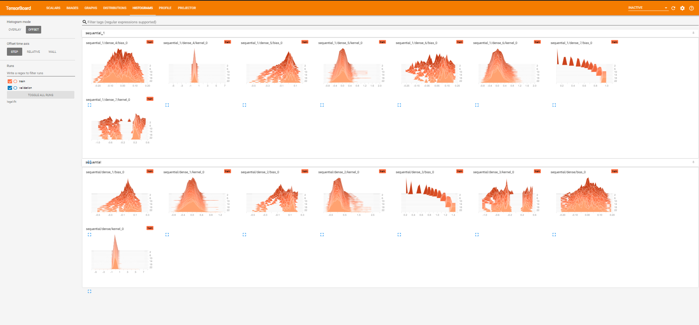
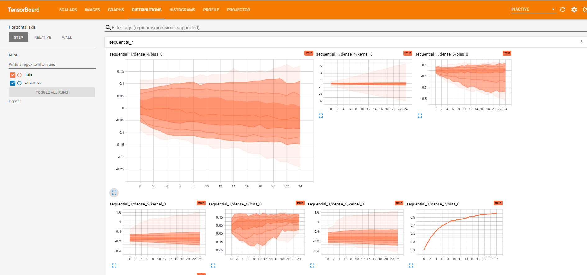

# Loan-Prediction

  

## Overview
• This repository consists of Loan Prediction Model which predict the new custome will repay the loan or not  . 
• Datasets are provided in each of the folders above, and the solution to the problem statements as well.

# TensorBoard

**Do ⭐ the repository.**

